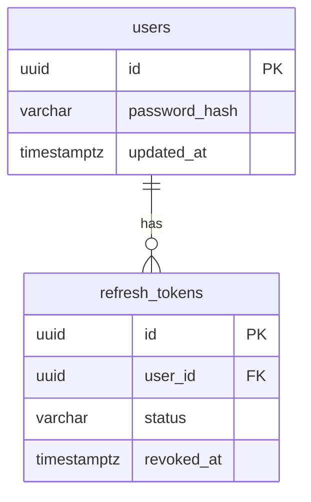

# Change password — schema & contract

**Status:** frozen  
**Parent:** extends existing [auth](auth.md) feature (no new tables)

## Requirements summary

Authenticated user can change their password by submitting **old password** and **new password**.

- Endpoint only when logged in (Bearer access token), same auth model as `GET /api/auth/me`
- Verify old password against stored BCrypt hash before updating
- New password must differ from old password
- Validation: both fields `@NotBlank`, `@Size(min = 8, max = 128)` (same as login; no extra complexity rules)
- No `confirmNewPassword` on the API (client may confirm)
- On success: update `users.password_hash`
- On success: revoke **all** active refresh tokens (kick other devices), then **issue a new refresh token for this device** and set the refresh cookie
- On success: return `200` with a **new access token** (`TokenResponse`) so the client can replace the in-memory JWT immediately
- Wrong old password → `401 Unauthorized` (same tone as login; do not reveal more)

## Schema

No Liquibase / DDL changes. Uses existing:

### users (relevant columns)
| Column | Type | Null | Notes |
|--------|------|------|-------|
| id | UUID | NO | PK — from JWT principal |
| password_hash | VARCHAR(255) | NO | BCrypt; updated in place |
| updated_at | TIMESTAMPTZ | NO | bumped on save via entity `@PreUpdate` |

### refresh_tokens (relevant for revoke-all)
| Column | Type | Null | Notes |
|--------|------|------|-------|
| user_id | UUID | NO | FK users |
| status | VARCHAR(32) | NO | ACTIVE → REVOKED for all of user |
| revoked_at | TIMESTAMPTZ | YES | set on revoke |

## API contract

| Method | Path | Auth | Request | Response |
|--------|------|------|---------|----------|
| POST | `/api/auth/change-password` | Bearer access | `ChangePasswordRequest` | `200` `TokenResponse` + Set-Cookie refresh |

### Request DTO

`ChangePasswordRequest` (`auth/dto`):
- `oldPassword` — `@NotBlank`, `@Size(min = 8, max = 128)`
- `newPassword` — `@NotBlank`, `@Size(min = 8, max = 128)`

### Success response

- Body: existing `TokenResponse` — `accessToken`, `expiresIn` (same shape as refresh-token)
- Cookie: new refresh token via `CookieAuthSupport.writeRefreshCookie` (same as login/refresh)
- Other devices: their refresh tokens are revoked; they must log in again

### Errors
| Case | Status | Exception / code |
|------|--------|------------------|
| Missing / invalid access token | 401 | security filter / `UnauthorizedException` |
| Wrong old password | 401 | `UnauthorizedException` — e.g. `"Invalid current password"` |
| New password equals old | 400 | `BadRequestException` |
| Bean validation failure | 400 | `VALIDATION_FAILED` + `fieldErrors` |
| User missing / inactive (edge) | 401 | `UnauthorizedException` |

## Controller

- Extend existing `AuthController` (`auth/controller`)
- `@PostMapping("/change-password")`
- `@AuthenticationPrincipal UserPrincipal principal`
- `@Valid @RequestBody ChangePasswordRequest`
- Call facade → write new refresh cookie → return `ApiResponses.ok(tokenResponse)`  
  (same cookie write pattern as `refreshToken`)

**SecurityConfig:** no change needed — path is under `.anyRequest().authenticated()` (do **not** add to `permitAll`)

## Repository contracts

### `RefreshTokenRepository` (extend)
- `List<RefreshToken> findByUserIdAndStatus(UUID userId, RefreshTokenStatus status)`
- Service loads active tokens, sets `REVOKED` + `revokedAt`, then `saveAll` (same style as single `revoke`)

### `UserRepository`
- No new methods required; use existing `save` / load-by-id via `UserService`

## Core service contracts (return entities / void)

### `UserService` (`user/service/core`) — add
- `User updatePasswordHash(UUID userId, String newPasswordHash)`  
  - Load user by id (active expected); set `passwordHash`; save; return entity

### `RefreshTokenService` (`auth/service/core`) — add
- `void revokeAllForUser(UUID userId)`  
  - Revoke every `ACTIVE` refresh token for that user
- Existing `issue(User user)` reused to mint the new token for this device

## Facade contract (orchestrator)

### `AuthFacade` / `AuthFacadeImpl` — add
- `AuthRefreshResult changePassword(UUID userId, ChangePasswordRequest request)`  
  - Reuse existing `AuthRefreshResult(TokenResponse, refreshTokenRaw)` (same as refresh-token)

**Flow:**
1. Load user by `userId` (reuse existing find-by-id with authorities)
2. `passwordEncoder.matches(oldPassword, user.passwordHash)` → else `UnauthorizedException`
3. If `oldPassword.equals(newPassword)` → `BadRequestException`
4. `passwordEncoder.encode(newPassword)` → `userService.updatePasswordHash(...)`
5. `refreshTokenService.revokeAllForUser(userId)`
6. `refreshTokenService.issue(user)` → new refresh for this device
7. `jwtService.createAccessToken(user)` → build `TokenResponse`
8. Return `AuthRefreshResult` for controller cookie + body

No new response mapper beyond constructing `TokenResponse` like refresh does.

## DTOs / mappers

| Name | Package | Notes |
|------|---------|-------|
| `ChangePasswordRequest` | `auth/dto` | record; validation annotations |
| `TokenResponse` | `auth/dto` | reuse existing |
| `AuthRefreshResult` | `auth/dto` | reuse existing (body + raw refresh) |
| Mapper | — | none new |

## Decisions (frozen)

| # | Topic | Decision |
|---|--------|----------|
| 1 | Wrong old password | `401 Unauthorized` |
| 2 | After success | Revoke **all** refresh tokens, then issue **new** refresh cookie for this device |
| 3 | Success response | `200` + `TokenResponse` (new access token) + Set-Cookie |
| 4 | Confirm field | No — only `oldPassword` + `newPassword` |
| 5 | Extra rules | Must differ from old; size 8–128 only |

## Implementation order (after freeze)

1. ~~Requirements / plan file~~ (this doc)
2. Repositories (`RefreshTokenRepository` revoke-all)
3. Core services (`UserService.updatePasswordHash`, `RefreshTokenService.revokeAllForUser`)
4. Facade + `ChangePasswordRequest`
5. Controller (+ optional Postman flow in Auth collection)

No Liquibase or new entities.

## Out of scope

- Frontend change-password UI (client should store the returned `accessToken` like refresh)
- Password complexity policy
- Forgot / reset password (unauthenticated)
